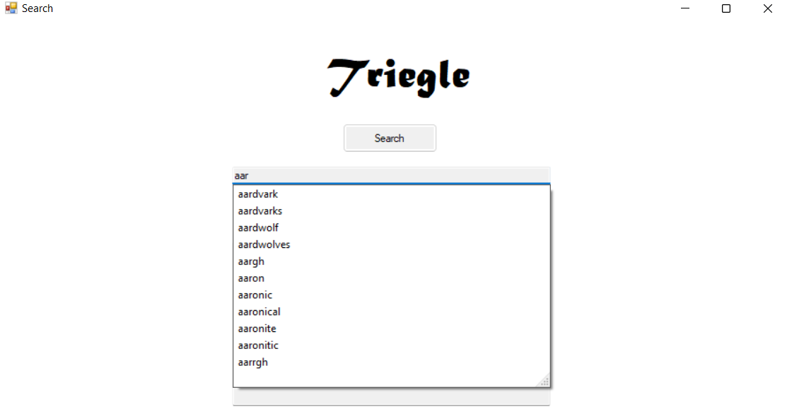
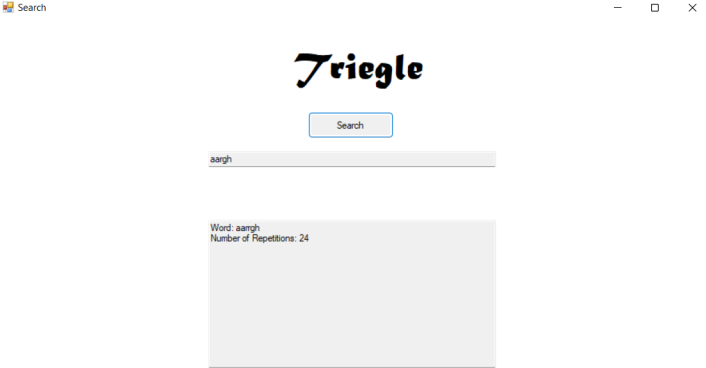

# Trie - Final Project
## 1. Introduction
### Trie
 Tries are a special implementation of a search tree, or tree data structure and can be used to efficiently search through large data files of string sets.
  The goal of this project was to show that our group was able to competently, research, implement and present a new data structure on our own.
  
  
  

 ## 2. Trie Operations
 All functions and operations within the trie class are all based off of a single blank root node where all unique characters following in the data set are subsequently connected to form individual paths of strings.
   
### Input
When compiling in `C++` the GCC compiler may produce four warnings. These warnings are for the character array that is an attribute to the `Node` class letting the user know that the compiler does not want to receive a negative index in the array. However there is no need to worry about this as the code will not provide a negative index.

The compile statement used in CS50 will be:

```text
$ g++ -std=c++11 -Wall *.cpp -o output
```
   
The input for the program should take in a file in `.txt` format from command line arguments such as:
 ```text
 <fname> file name for dictionary set of strings being passed in
  ```
### Read File

The readfile function can be called after construction where the data contents of the file are simply read into a string stream, through a while loop, and a line of data from the file and converts each string of characters into a key. Each key is then inserted into the trie by calling the insert function.

### Insert

After calling the constructor, the insert function then ensures that the character value is being inserted into the correct spot in the trie. As the trie is completed, the data in each node is stored in a top-down manner with individual branches representing a string. This is done by:

1. We start at a blank node for the root of the trie
2. If the child node does not already exist create a new node of the data
3. If child node already exists traverse to next node
4. Repeat until end of string is reached
5. Set final character node property (Leaf node) to true
6. Set counter for string

### Search

Searching for a string in the trie is simply traversing the nodes for the desired string. The strategy for this is:

1. Start at blank node
2. Check to see if node has child
3. If child exist, repeat until end of string is reached
4. If node does not exist return false
5. If end of word is reached and node is leaf node, return true
6. If end of word is reached and node is not leaf node, return false
7. Output counter of words (greater than 1 means repeated word)

### Have Children

Checks for child nodes.

### Autocompletion

To find possible autocompletions of a prefix in the trie two functions are used to do this. The first function `auto_comp(...)` takes in the prefix the user is searching for and checks if it exists in the trie. Then it calls a recursive helper function to find the complete strings containing the prefix and present them.

The recursive helper function for autocomplete takes in the node root and desired prefix as parameters and iteratively checks for words by:

1. Checking if the root is a leaf node
2. Checking if root node has no children
3. Finally pushing all subsequent node values of the prefix onto a string 
4. Prints out string
5. Pops off values after prefix

### DOT File

The last two functions of the program are used to produce a text file that can then be easily converted into DOT language for a DOT file or directly output the file into DOT file format (depending on the software used). The initial print function that is called creates an output stream that takes in a file name and produces the total format for the entire graph.

Then it calls the recursive print function that will connect all nodes within the trie by printing out the respective node names and connector symbols for the DOT language to produce a visual diagram, such as the one below.


## 3. Output

The expected output of the insert function will produce terminal commands that should look similar to:

```text
Adding <inserted word> to the trie. . . 
Adding <inserted word> to the trie. . . 
Adding <inserted word> to the trie. . . 
Adding <inserted word> to the trie. . . 
```

The expected output of the search function will produce terminal commands that should look similar to:

```text
Searching for <word> within trie...
<word count>: <number of times word is repeated in trie>
Searching for <word> within trie...
<word> was not found in trie
```

The expected output of the autocomplete function will produce terminal commands that should look similar to:

```text
Looking for prefix <prefix>
Found: <string in trie containing prefix>
Found: <string in trie containing prefix>
Found: <string in trie containing prefix>
```

A DOT file will be produced because of the output stream from print functions.

## 4. GUI (Optional)

The expected GUI to be simple model of autocomplete and repetition of words in dictionary:



